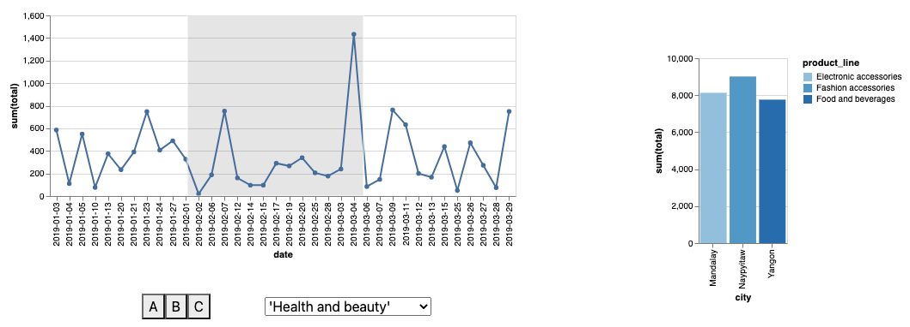

### Systems

It is very difficult to design and build interactive data analysis interfaces that are useful for a given analysis task, highly responsive, and scalable to large datasets.  Developers must piece together technologies that span the browser, server, database, and cloud platforms, and attempt to optimize across all of these layers.  This motivated me to develop optimization and programming abstractions that are specific to the needs of interactive data interfaces.

<a name="smoke"/>
##### Lineage Instrumentation in Query Engines

Interfaces render data as pixels on the screen, and when the user points to or manipulates pixels, they are implicitly referencing the underlying data (the data lineage) of those pixels. If query engines could efficiently track lineage, then interactive interfaces could be expressed using lineage and automatically optimized.  

Fotis Psallidas and I observed that although no such engines existed, the fact that highly responsive data interfaces exist, and are expressible using lineage, is proof that it should be possible.   We found that lineage tracking can "piggy back" on top of the work that the database already performs during operator execution to reduce the overhead from 10-1000x to 0.3-1.2x. We integrated these ideas into the [Smoke query engine](https://arxiv.org/abs/1801.07237), which is the first that can express interactive interfaces using lineage constructs and execute it at interactive speeds.  

14.4M tuple flights dashboard that simulates every possible filter interaction.  Smoke materializes lineage when it runs the queries to load the initial charts, and optimizes each interaction using the lineage indexes.  Smoke finishes the benchmark before data cubes can even be built. 

Our [HILDA paper](https://www.dropbox.com/s/fkp5hk1gp4lrg9h/smoke-hilda18.pdf?dl=0) articulated the connections between lineage and visualization interaction, and also described how lineage enables novel interface functionalities such as data explanation, cross-application linking and interactions, interaction histories, and interaction-by-example.    We are currently studying additional opportunities for piggy backing in production late-materialization columnar engines, and how lineage data structures can be easily managed with minimal memory pressure.

* Fotis Psallidas, Eugene Wu.  [Smoke: Fine-grained Lineage at Interactive Speeds](https://arxiv.org/abs/1801.07237)  VLDB 2018
* Fotis Psallidas, Eugene Wu.  [Provenance for Interactive Visualizations](https://www.dropbox.com/s/fkp5hk1gp4lrg9h/smoke-hilda18.pdf?dl=0) HILDA 2018
* Fotis Psallidas, Eugene Wu.  [Demonstration of Smoke: A Deep Breath of Data-Intensive Lineage applications](https://www.dropbox.com/s/io5hpu5rn4tl9m5/smoke-sigmod18demo-cr.pdf?dl=0) SIGMOD Demo 2018

<a name="khameleon"/>
##### General Prefetching Framework

One of the biggest headaches when building networked interactive data applications is network communication.  The defacto approach to hide communication latencies is to predict user requests ahead of time and prefetch them, and the bulk of research focuses on improving prediction accuracy.   However, prefetch is simply not effective for interactive data applications: users can generate dozens of requests per second that retrieve non-trivial amounts of data. This can easily cause network congestion, and prefetching adds to the congestion if it is not carefully designed.

[Khameleon](https://arxiv.org/pdf/2007.07858.pdf) is a general prefetch framework that manages client-server communication.   Its main idea is to model communication as a scheduling problem to allocate portions of network bandwidth to future requests.  The server continuously pushes fragments of response data to the client, where a fragment is sufficient to render an approximate, lower quality response. The scheduling formulation lets the developer focus on application-specific policy decisions to balance response quality (by dedicating all bandwidth to a few likely requests) and user-latency (by sending a tiny amount of many potential requests).   Even when compared to classic prefetching using a perfect prediction model, this scheduling formulation reduces response latency by 2 orders of magnitude and improves response quality.  

  
    
  
  &nbsp;
  
    
  

User hovers over a grid of 10K thumbnails to see the full size image.  Light circle shows mouse location. <b>(Left)</b> traditional prefetching, even with a perfect predictor, incurs seconds of delay. <b>(Right)</b> khameleon responds immediately as the user interacts.   

* Haneen Mohammed, Ziyun Wei, Ravi Netravali, Eugene Wu. [Continuous Prefetch for Interactive Data Applications](https://arxiv.org/pdf/2007.07858.pdf) VLDB 2020
* [Haneen's talk at VLDB 2020](https://www.youtube.com/watch?v=oiU5xytHMm4)
* [A blog post](https://medium.com/thewulab/for-responsive-interactive-apps-prediction-is-not-enough-3188bc7b53db) that describes the system in more detail.

<a name="perc"/>
##### Perceptual Approximation

When users visually decode data in a visualization, it is an inherently approximate process.  If we could create perceptual models that quantify these inaccuracies, could  data processing systems leverage these models?  This is akin to extending semantic equivalence in databases (that two query plans return the same results) to perceptual equivalence (that two query plans are perceived to be the same).  One challenge is that neither perceptual models nor algorithms that use them existed.

From the perceptual side, we developed the [first quantitative models](https://arxiv.org/pdf/1811.03180.pdf) to assess when a visualization is _too complex_ to be decoded in any meaningful way (say, due to noise).  To do so, we proposed a measure called Pixel Approximate Entropy, and showed its suitability as a complexity measure.  We also find evidence that beyond a certain complexity level, users may not be able to decode any underlying signal from a visualization.   We further studied how [progressive visualizations affect cognitive biases in users](https://www.dropbox.com/s/kzjotdoq9zpmuxf/marianne-bias-tvcg20-cr.pdf?dl=0) and the extent that design or user contral matters.

* Gabriel Ryan, Abigail Mosca, Remco Chang, Eugene Wu. [At a Glance: Approximate Entropy as a Measure of Line Chart Visualization Complexity](https://arxiv.org/pdf/1811.03180.pdf)  InfoVIS 2018
* Marianne Procopio, Ab Mosca, Carlos Scheidegger, Eugene Wu, Remco Chang. [Impact of Cognitive Biases on Progressive Visualization](https://www.dropbox.com/s/kzjotdoq9zpmuxf/marianne-bias-tvcg20-cr.pdf?dl=0) TVCG 2021

We further developed online aggregation algorithms that [leverage perceptual models](http://sirrice.github.io/files/papers/pfunk-hilda16.pdf), and for [visualizations over join queries](https://www.dropbox.com/s/2n1a4l0k63x9o4x/loadngo-dsia17.pdf?dl=0).

* Daniel Alabi, Eugene Wu.  [PFunk-H: Approximate Query Processing using Perceptual Models](http://sirrice.github.io/files/papers/pfunk-hilda16.pdf)  HILDA 2016
* Marianne Procopio, Carlos Scheidegger, Eugene Wu, Remco Chang.  [Load-n-Go: Fast Approximate Join Visualizations That Improve Over Time](https://www.dropbox.com/s/2n1a4l0k63x9o4x/loadngo-dsia17.pdf?dl=0)  DSIA 2017

<!--
<a name="async"/>
##### Visualization Asynchrony

Visualizations are distributed systems, where the user, the browser, and the data processing system are all running in parallel and communicating asynchronously.  

[DIEL: Interactive Visualization Beyond the Here and Now](https://www.dropbox.com/s/qfuzuaukypinh0c/diel-infovis21-submitted.pdf?dl=0)
Yifan Wu, Remco Chang, Joe Hellerstein, Eugene Wu. [Facilitating Exploration with Interaction Snapshots under High Latency]() InfoVIS (short paper) 2020
Yifan Wu, Joe Hellerstein, Eugene Wu.  [A DeVIL-ish Approach to Inconsistency in Interactive Visualizations]() HILDA 2016
-->

### Interfaces & Design

A designer's job is difficult because even small interaction design changes could require considerable system changes and resources in order to ensure that the interface is responsive.  My research has contributed algorithmic techniques and systems to aid the interface and system co-design process, as well as ways to generate interfaces automatically.

<a name="pvd"/>
##### Physical Visualization Design

Systems are optimized for specific workloads at the expense of others.  Yet, how can a designer know when an interface change will fall off a performance cliff?  Or what combination of visualization optimizations are needed to keep interactions responsive?

My vision is a visualization design tool, similar to Photoshop or Figma, that answers these types of questions while taking into account existing database information and resource constraints.  As the designer adds visualizations and interactions, the tool alerts the designer when an interaction's latency expectations will be violated, and suggests the necessary optimizations.   In addition, it helps forecast additional resource costs as the database grows

The core of this tool is the Physical Visualization Design (PVD) optimizer, which takes as input the interface specification, an existing database, and a library of optimizations (indexes, data cubes, etc), and recommends a set of optimizations to meet the designer’s latency expectations and stay within resource limits.    This is inspired by physical database design, but differs in several key ways.  First, instead of a sample query workload, the interface representation symbolically encodes the entire workload, and interactions can be annotated with their likelihoods of being used, as well as their latency expectations.    Second, PVD treats the database as the "slow path" and builds data structures that bypass the database.  Third, PVD decides whether these data structures should be placed on the client, the server, or both.  

We presented a demo paper in 2020 based on a toy interface, and are in the process of a full submission that can automatically optimize real visualization applications used in practice.

* Lana Ramjit, Zaoning Kong, Ravi Netravali, Eugene Wu.  [Physical Visualization Design](https://www.dropbox.com/s/i6dngaqr1xyo9fg/pvd-sigmod20demo-cr.pdf?dl=0).  SIGMOD 2020 demo

<a name="pi"/>
##### Precision Interfaces

Precision Interfaces studies whether it is possible to automatically generate interfaces from analysis queries. If so, custom interfaces could be created by simply performing the intended analysis, by monitoring live analysis sessions, or by mining existing query logs (e.g., collected by existing data systems) to synthesize shared interfaces. Further, these interfaces would be highly adapted to individual users’ analysis workflows, reduce cognitive load and user errors, and improve data accessibility.

  <!--
<code>select city, product_line, sum(total) from sales as ss where ss.date between '2019-01-05' and '2019-03-10' group by city, product_line having sum(total) >= ( select max(t) from ( select sum(total) as t from sales as s where s.city = ss.city and s.date between '2019-01-05' and '2019-03-10' group by s.city, s.product_line ) )
...
select date, sum(total) from sales where branch = 'A' and product_line = 'Health and beauty' group by date
select date, sum(total) from sales where branch = 'B' and product_line = 'Electronic accessories' group by date
...</code> 
-->
  

    
<iframe src="https://www.loom.com/embed/6551e2208acb484cac29dd37f3488d6f" frameborder="0" webkitallowfullscreen mozallowfullscreen allowfullscreen style="position: absolute; top: 0; left: 0; width: 100%; height: 100%;"></iframe>

    <!---->
  

  

  Precision interfaces incrementally generates interfaces based on queries that have been executed.  It abstracts the structural transformations (such as switching subqueries and contexutally modifying them) and maps the transformations to visualizations and interactions.
  <!--Precision interfaces uses queries that analyze a <a href="https://www.kaggle.com/aungpyaeap/supermarket-sales">Kaggle supermarket sales dataset</a> to generate the interactive visualization.   The line chart renders total sales over time for different branches (A, B, or C) and product lines (health, electronics, etc).  The bar chart renders the product with the highest sales in each city within the period selected in the line chart.  -->
  

Our key insight is that interactive interfaces are not arbitrary programs. Instead, interactions change an underlying program in systematic ways: e.g., a slider controls a numeric parameter, a button replaces a query. Thus, an interface expresses the set of queries needed for the desired analysis task, and the input queries are a sample sequence generated from this “latent” interface.  Based on this insight, we [formally modeled this as a mapping problem](https://arxiv.org/abs/1904.02344) from queries to a set of interactive widgets, and extended it to support [natural language, mouse, and touch input  modalities](https://www.dropbox.com/s/0hqjy6ha0antw7u/precisoninterface-sigmod2018demo-cr.pdf?dl=0)  and to [determine layouts based on screen size](https://arxiv.org/abs/2001.01902). Our current work extends this formalism to interactive visualizations, and can generate fully interactive interfaces containing multiple visualizations.

* Yiru Chen, Eugene Wu. [Monte Carlo Tree Search for Generating Interactive Data Analysis Interfaces](https://arxiv.org/abs/2001.01902) Intelligent Process Automation (IPA) 2020
* Qianrui Zhang, Haoci Zhang, Viraj Rai, Thibault Sellam, Eugene Wu.  [Precision Interfaces](https://arxiv.org/abs/1904.02344) SIGMOD 2019
* Haoci Zhang, Viraj Rai, Thibault Sellam, Eugene Wu. [Precision Interfaces for Different Modalities](https://www.dropbox.com/s/0hqjy6ha0antw7u/precisoninterface-sigmod2018demo-cr.pdf?dl=0) SIGMOD 2018 demo

### Explanation

What interaction capabilities should future data interfaces support?   I believe a core capability is to explain the data that the user sees.    My research introduced this problem, and extended its ideas towards ML debugging.

<a name="scorpion"/>
##### Query Explanation

Query explanation takes a user "complaint" that query results (in a visualization) are surprising (e.g., why are this month's losses so high?), the system proposes hypotheses  (e.g., ignoring the NY market would keep losses stable) in the form of predicates that "explain-away" these complaints. These explanations describe interventions that, if applied to the database, would help address the user complaints.   I have extended explanations to several new settings.

Queries are often incorrect due to data errors; data errors are introduced by transactions that insert corrupt data or update the database incorrectly.  We studied a variation of the explanation problem that identifies past erroneous transactions that are responsible for user complaints.  The idea is to model the database as the materialization of the transaction log, 

* Xiaolan Wang, Alexandra Meliou, Eugene Wu. [QFix: Diagnosing errors through query histories](http://sirrice.github.io/files/papers/qfix-sigmod17.pdf) SIGMOD 2017
* Xiaolan Wang, Alexandra Meliou, Eugene Wu. [QFix: Demonstrating error diagnosis in query histories](http://sirrice.github.io/files/papers/qfix-sigmod16.pdf) SIGMOD 2016 Demo

More recently, we started a collaboration with Columbia Earth Institute's Financial Instruments Sector Team (FIST), which develops national drought protection programs for farmers in African countries such as Ethiopia and Zambia.  Since these areas are often "data voids", FIST surveys villages to collect data on historical droughts, however farmers may misreport the information.  The high-level goal is to help FIST researchers clean the data by identifying potential errors at a coarse-grained level (e.g., national), and helping them incrementally "zoom in" along the appropriate dimensions to identify the districts or villages to contact.  To this end, we developed visual exploration tool that lets users complaint about suspicious  data, and ranks drill-down operations based on their expected contribution to the complaint.  The tool succesfully found 20 out of 22 known errors, and is actively used in the Ministry of Agriculture in Zambia.

* Zezhou "Zachary" Huang, Eugene Wu.  [Reptile: Aggregation-level Explanations for Hierarchical Data](https://arxiv.org/pdf/2103.07037.pdf)  In review.

Since our work appeared, many in the database community have extended it to different applications and to different types of errors or complaints, and developed highly scalable implementations.  For example, see [Miao et al.](http://www.vldb.org/pvldb/vol12/p1806-miao.pdf), [Roy et al.](https://dl.acm.org/doi/pdf/10.14778/2856318.2856329), and [Abuzaid et al.](https://link.springer.com/article/10.1007/s00778-020-00633-6).

<a name="rain"/>
##### Complaint-driven Debugging

Explanation has strong ties to data cleaning. For instance, when explaining an anomaly (e.g., if we ignored this data and fixed these values, then the output would look normal) each step (e.g., ignore, fix) is also a cleaning intervention. However, cleaning typically focuses on a given dataset, whereas explanations take the downstream analysis into account. This novel complaint-driven data debugging is more user-friendly and helps identify data errors that matter to the use case. 

* Felix Neutatz, Binger Chen, Ziawasch Abedjan, Eugene Wu.  [From Cleaning before ML to Cleaning for ML](http://sites.computer.org/debull/A21mar/p24.pdf) IEEE Data Engineering Bulletin 2021

We applied this concept in some of the first data cleaning approaches specifically designed to improve a ML model.  We started by developing an active learning-style framework to iteratively select the training records to clean that will most improve a down-stream model.  We then extended the ideas to a boosting framework to select a good sequence of parameterized cleaning operations to apply, and a hyperparameter tuning framework that views  the entire cleaning pipeline as a black box to optimize.

* Sanjay Krishnan, Jiannan Wang, Eugene Wu, Michael J. Franklin, Ken Goldberg. [Activeclean: Interactive data cleaning for statistical modeling](https://dl.acm.org/doi/abs/10.14778/2994509.2994514) VLDB 2016
* Sanjay Krishnan, Eugene Wu.  [AlphaClean: Automatic Generation of Data Cleaning Pipelines](https://arxiv.org/abs/1904.11827) Technical Report 2019
* Sanjay Krishnan, Michael J. Franklin, Ken Goldberg, Eugene Wu.  [BoostClean: Automated Error Detection and Repair for Machine Learning](https://arxiv.org/abs/1711.01299) Technical Report 2017
* Sanjay Krishnan, Michael Franklin, Ken Goldberg, Jiannan Wang, Eugene Wu. [ActiveClean: An Interactive Data Cleaning Framework For Modern Machine Learning](http://eugenewu.net/files/papers/activeclean-sigmod16demo.pdf) SIGMOD 2016 demo award winner.

More recently, we developed complaint-driven approaches for training data debugging in ML analysis workflows.  This is a natural fit because evidence of data errors is often only detected in the output of downstream analytics, and they need to be translated into errors in the training.    Rain ranks training data interventions for relational workflows over ML predictions.  It models the query result as a differentiable provenance polynomial over the prediction probabilities, and combines this with influence functions to differentiate the end-to-end training and analysis pipeline.    We further developed offline materialization techniques that lets Rain debug complaints interactively and scale to Neural Networks with millions of parameters.

* Weiyuan Wu, Lampros Flokas, Eugene Wu, Jiannan Wang.  [Complaint-driven Training Data Debugging for Query 2.0](https://arxiv.org/pdf/2004.05722.pdf) SIGMOD 2020
* Lampros Flokas, Young Wu, Jiannan Wang, Eugene Wu.  [Towards Complaint-driven ML Workflow Debugging](https://www.dropbox.com/s/yxip1pd6rnxj8ev/mlexplain-mlops20-submitted.pdf?dl=0)  MLOps 2020
* Lampros Flokas, Weiyuan Wu, Yejia Liu, Jiannan Wang, Nakul Verma, Eugene Wu [Complaint-Driven Data Debugging at Interactive Speeds](https://www.dropbox.com/s/rxj5os564g0nrmp/rainpp-vldb21-v1.pdf?dl=0)  In submission.

<!--
##### Visual Composition Algebra
-->

