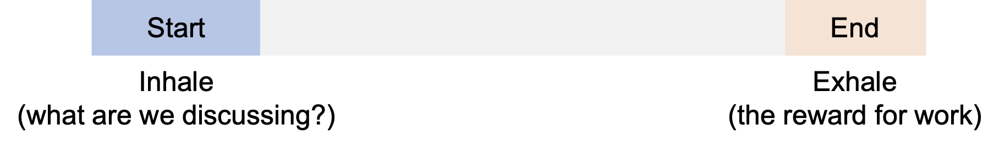

<style>
.peach { background: #FBE5D6; }
.blue { background: #B4C7E7; }
</style>

# How to syntactically structure your writing

The purpose of writing is to communicate to the reader.  Since both writing and reading are lossy processes, we want to write in a way that: 

* is unambiguous
* is easy to read (discussed below)
* is convincing

It turns out that _syntactic structure_ directly affect the reader's ability to easily and accurately decode what's on the page!


## Example of Syntactic Structure That Matters

As a trivial example where syntactic structure is important, consider the following information:

```
    t(t) = 15, T(temperature) = 32; t=0, T=25;
    t=6, T=29; t=3, T=27; t=12, T=32; t=9, T=31;
```

This piece of writing conveys temperature over time.  However, consider this syntactic reorganization:

```
    time (min)    temperature (C)
       0               25
       3               27
       6               29
       9               31
      12               32
      15               32
```

It's now clear that time is sampled in 3 minute intervals, and that the temperature is rising linearly over time (The field of data visualization goes further to instead encode this data as a visualization).   

Note that you read the data from left to right.  This is because you _expected_ a certain  structure:

1. You expected the independent variable (time) to be on the left.  It exhibits 'regularity', and is a concept we already  understand.
2. You expected the dependent variable (temperature) to be on the right. It refers to the exciting new information.

This left to right flow is a common pattern that *readers expect when they read english*:

```
    Expectation   --->  Discovery
            in other words
       Old info   --->  New Info
```

Think about when you read a paper.  You expect it to follow a certain structure of Introduction, Methods, Conclusion, with Related Works thrown in after the intro or before the conclusions.  If the paper is not organized this way, it instills confusion and forces the reader to work harder to figure out why.


## Units of Discourse

Writing is composed of _units of discourse_.  A unit can be a clause, a sentence, a paragraph, a section, or an article.
The most important principle is that a unit conveys _a single point_.   Consider the following examples:

1. A paper studies and reports a single idea.  
  * Wikipedia's page on [List of Important Papers in CS](https://en.wikipedia.org/wiki/List_of_important_publications_in_computer_science#Databases) actually has great examples of the core ideas from many classic CS papers.  
  * For instance, Codd's [A relational model for large shared data banks](https://www.seas.upenn.edu/~zives/03f/cis550/codd.pdf) says 'the relational model for databases is a great idea'.    
  * From my own papers, [Precision Interfaces](https://arxiv.org/abs/1904.02344) says 'interfaces can be created from query logs', while [Smoke](https://arxiv.org/abs/1801.07237) says 'record-level lineage can be super fast'.  
2. Each section in a paper focuses on a single idea.
  * The related work's section says 'this work is different than everything else'
  * The introduction section says 'this work is novel'
  * The experiments section says 'see?  I told the truth'
3. A paragraph says a single idea.
  * The first paragraph of the intro usually says 'here's why this research area is useful'.
  * The last paragraph of the intro usually says 'here's all the great stuff we did'.

Note that an article is composed of sections, which are composed of paragraphs, and so on.   Thus, you can think of each unit (say, an article) as a tree of smaller units.  Each tree makes a single point, and each node's point is argued in more detail by its child units.  


## How to Connect Units Together


Consider a unit at the granularity of a sentence.  We will discuss how people rely on its syntactic structure to decode a sentence, and what readers expect when reading from one sentence to the next.  We use sentence as the example, but the principles apply to units of any granularity.  

These principles are:

* The subject is shortly followed by the verb
* The point of the sentence is found at the end of the sentence (the stress position)
* The beginning of the sentence is the topic (the topic position)

As a example, in the sentence **Spot chased the cat**, the subject refers to **Spot**, the verb is **chased**, and what we learn is that the subject **chased the cat**.


### Subject Followed By Verb

Once the reader has found the subject, she literally waits in anticipation for the verb.  Without the verb, the reader doesn't know what the subject is doing.  This penalizes the reader in two ways:

* the reader will ignore intervening text (missing information), or 
* the reader will need to go back after finding the verb (more work for the reader)

Consider this mess:
>_**Once the subject**, the part of the sentence that describes what the sentence is about or who performs an action **has been found**, she literally waits in anticipation for the verb._


The issue is that the subject and verb is separated by over a dozen words; the reader needs to wade through this mess to find the verb.  A simple reorganization brings the subject next to the verb, and simplifies the sentence:   

> _**Once the subject**  **has been found**, she literally waits in anticipation fo the verb.  The subject is the part of the sentence..._


### The Stress Position: the Point of the Sentence 

The reader mentally inhales when she starts a sentence (or any unit), and exhales at the end.   When she starts, she expects a reference to something she already knows, or has already learned earlier.  When she finishes, she expects to be rewarded with new information.    

> 

The end of the sentence is called the **Stress Position**.   The reader expects that the point is at the end of the sentence (new information).  In the following example, the reader is likely to think that Spot is a West Nile Lion.

> _<span class='blue'>Spot</span>, a big yellow dog with a brown spot, bit the neighbor’s cat that was found to be <span class='peach'>similar to a species of lion in the West Nile</span>_

The reason this happens is because the sentence has multiple points that it is trying to make.  Remember: each unit makes a single point!  To fix this issue, we can syntactically introduce additional units, one for each point.  Note that a semicolon separates two related thoughts, where thought can be considered a standalone sentence:

> <span class='blue'>Spot</span> <span class='peach'>is a big yellow dog with a brown spot</span>.  <span class='blue'>He</span> <span class='peach'>bit the neighbor’s cat</span>; <span class='blue'>the cat</span> was found to be <span class='peach'>similar to a species of lion in the West Nile</span>.


### The Topic Position: Backward Reference

Finally, the start of the sentence is called the **Topic Position**.   The reader expects something she already knows (old information).  Thus, it should either reference 1) a previous topic position/subject or 2) a previous stress position.   Note that this is typically where the reader expects the subject of the sentence.


In the following is an example where the topic position of the second sentence refers to the stress position (<span class='peach'>cat</span>) from the previous sentence.  This is an example of _flow_.  

> 

But if the first sentence is different, we lose the flow.    <span class='blue'>The cat</span> does not refer to anything in the previous sentence!

> 

We can fix this by making spot the topic of the second sentence.  Now there is a connection (flow) between the two sentences.  

> 


This is why passive sentences are discouraged.  They often move new information into the topic position.  Remember, new information (the surprise) should be in the stress position.  For an example of an extreme abuse of the passive voice, [see this article](https://www.mcsweeneys.net/articles/an-interactive-guide-to-ambiguous-grammar).


## Summary

These principles are very simple, but apply consistently to sentences, paragraphs, and even sections.
Keep in mind that these are _syntactic_ expectations, and do not deal with semantics.
Adhering to these principles is needed to make the content easier and unambiguous to decode, but _what_ the content is needs to make sense as well.

When writing (or communicating in general) ask yourself these questions:

* What is the subject of this unit?  Is it in the topic position?
* Is the topic related to the previous topic/stress positions?
* What am I trying to convey?  Is it in the stress position?
* Is the verb near the subject?

To summarize, here is a helpful diagram of everything we discussed:

> 

