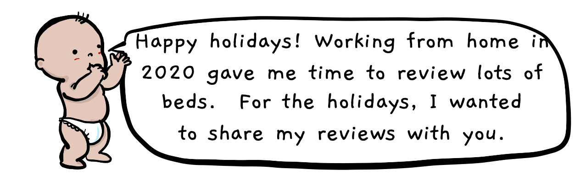

    
    
The screen size is too small.  Can you make the browser window wider?

  

    
  

  

    Prev
    Next
  

  

    

        
        <!---->
        

    

    

      <h3 id="name"></h3>
      
 

      

        {{img.review}}
      

    

    
  

